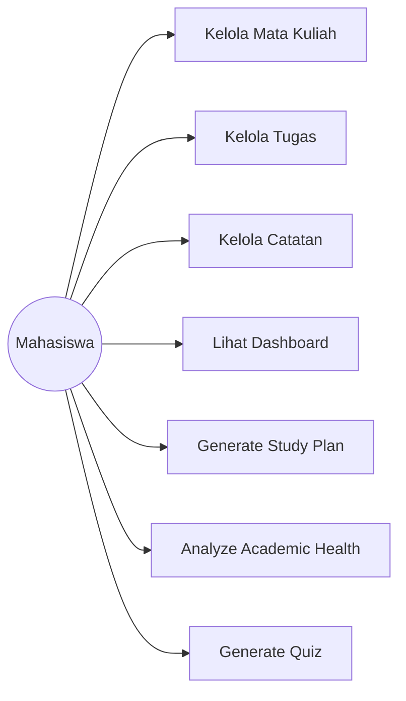
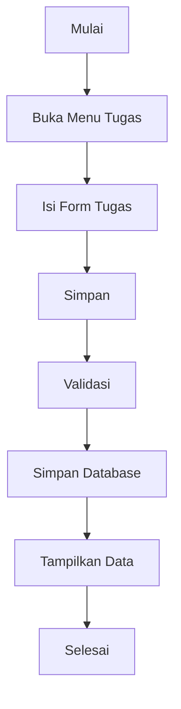
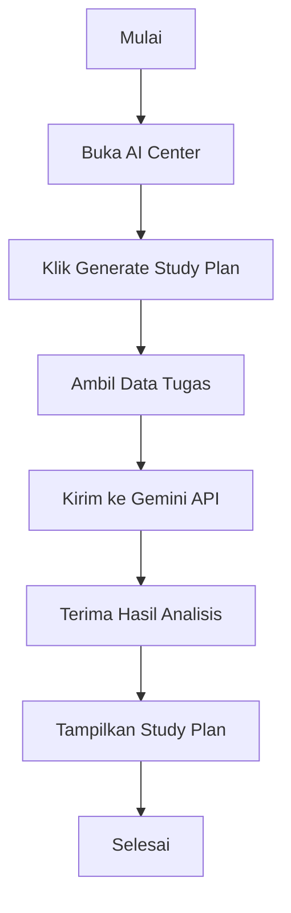
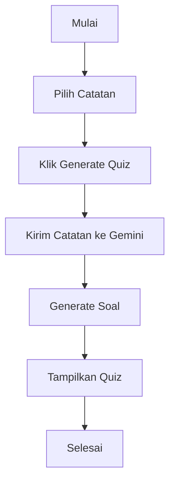
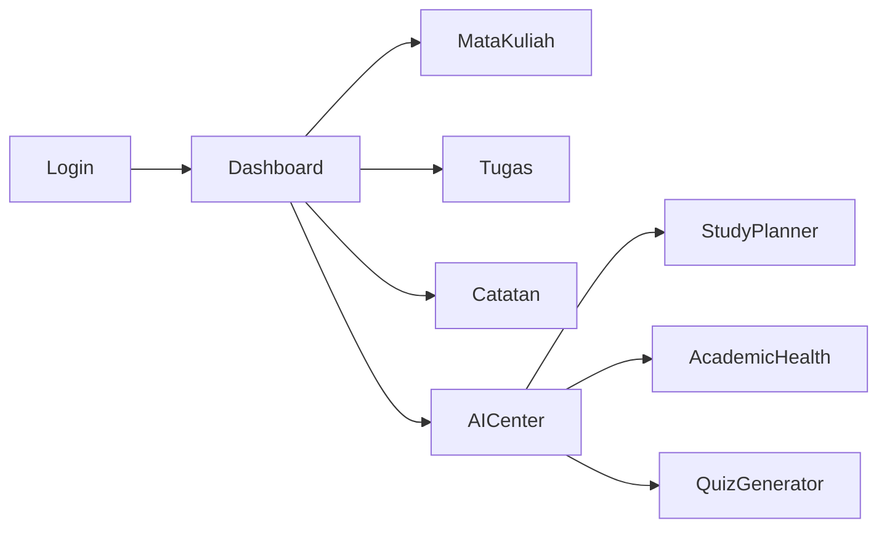

# SOFTWARE REQUIREMENTS SPECIFICATION (SRS)

# UMT Academic Assistant

### AI-Powered Academic Productivity Platform

Version: 1.0

Status: Draft

---

# 1. Introduction

## 1.1 Purpose

Dokumen ini menjelaskan kebutuhan perangkat lunak (Software Requirements Specification) untuk aplikasi UMT Academic Assistant.

Dokumen ini menjadi acuan dalam proses desain sistem, implementasi, pengujian, dan evaluasi aplikasi.

---

## 1.2 Scope

UMT Academic Assistant merupakan aplikasi desktop berbasis Java yang membantu mahasiswa mengelola aktivitas akademik serta memanfaatkan Artificial Intelligence untuk mendukung proses belajar.

Fitur utama:

* Manajemen Mata Kuliah
* Manajemen Tugas
* Manajemen Catatan
* Smart Study Planner
* Academic Health Analyzer
* Quiz Generator

---

## 1.3 Intended Users

* Mahasiswa UMT
* Dosen Pengampu Mata Kuliah OOP
* Tim Pengembang

---

# 2. Overall Description

## 2.1 Product Perspective

Aplikasi berjalan secara desktop menggunakan Java Swing.

Data disimpan menggunakan MySQL.

Fitur AI menggunakan Gemini API.

---

## 2.2 Product Functions

Sistem dapat:

* Mengelola mata kuliah
* Mengelola tugas
* Mengelola catatan
* Menampilkan dashboard akademik
* Menghasilkan jadwal belajar menggunakan AI
* Menganalisis kondisi akademik menggunakan AI
* Menghasilkan soal latihan menggunakan AI

---

# 3. Functional Requirements

## Modul Login

### FR-10 Login Pengguna

User dapat melakukan login sebelum masuk ke sistem utama.

Requirements:
* User memasukkan username.
* User memasukkan password.
* Sistem mencocokkan kredensial dengan database `users`.
* Sistem memvalidasi form login agar tidak boleh kosong.
* Sistem membuka Main Dashboard setelah login sukses.
* Sistem menginisialisasi akun admin default (username: admin, password: admin123) pada startup pertama jika tabel kosong.

Aturan Validasi:
* Jika username atau password kosong: Tampilkan pesan "Mohon lengkapi username dan password".
* Jika username atau password salah: Tampilkan pesan "Username atau password salah".

---

## Modul Mata Kuliah

### FR-01

User dapat menambah mata kuliah.

### FR-02

User dapat mengubah mata kuliah.

### FR-03

User dapat menghapus mata kuliah.

### FR-04

User dapat melihat daftar mata kuliah.

---

## Modul Tugas

### FR-05

User dapat menambah tugas.

### FR-06

User dapat mengubah tugas.

### FR-07

User dapat menghapus tugas.

### FR-08

User dapat melihat daftar tugas.

---

## Modul Catatan

### FR-09

User dapat menambah catatan.

### FR-11

User dapat mengubah catatan.

### FR-12

User dapat menghapus catatan.

### FR-13

User dapat melihat catatan.

---

## Modul AI

### FR-14

User dapat menghasilkan Smart Study Plan.

### FR-15

User dapat menjalankan Academic Health Analyzer.

### FR-16

User dapat menghasilkan Quiz menggunakan AI.

---

## Dashboard

### FR-17

User dapat melihat statistik akademik.

---

# 4. Non Functional Requirements

## Performance

NFR-01

Waktu respon CRUD maksimal 2 detik.

---

NFR-02

Waktu respon AI maksimal 10 detik.

---

## Reliability

NFR-03

Data tersimpan secara permanen dalam database.

---

## Usability

NFR-04

Aplikasi dapat digunakan tanpa pelatihan khusus.

---

## Security

NFR-05

API Key tidak disimpan secara hardcode.

---

# 5. Business Rules

BR-01

Setiap tugas harus terkait dengan satu mata kuliah.

---

BR-02

Status tugas hanya boleh:

* Belum Dikerjakan
* Sedang Dikerjakan
* Selesai

---

BR-03

Quiz hanya dapat dibuat dari catatan yang telah tersimpan.

---

BR-04

Academic Health Analyzer menggunakan data tugas yang tersedia.

---

BR-05

Study Planner menggunakan deadline tugas sebagai dasar prioritas.

---

# 6. Use Case Diagram

---

# 7. Use Case Description

## UC-01 Kelola Mata Kuliah

Actor:
Mahasiswa

Precondition:
Aplikasi terbuka.

Main Flow:

1. Mahasiswa membuka menu Mata Kuliah.
2. Mahasiswa menambah data.
3. Sistem menyimpan data.
4. Data ditampilkan pada tabel.

Post Condition:

Data mata kuliah tersimpan.

---

## UC-02 Kelola Tugas

Actor:
Mahasiswa

Main Flow:

1. Membuka menu tugas.
2. Menambah tugas.
3. Menyimpan data.
4. Sistem menampilkan daftar tugas.

---

## UC-03 Kelola Catatan

Actor:
Mahasiswa

Main Flow:

1. Membuka menu catatan.
2. Menambah catatan.
3. Menyimpan catatan.
4. Sistem menampilkan daftar catatan.

---

## UC-04 Generate Study Plan

Actor:
Mahasiswa

Main Flow:

1. Membuka AI Center.
2. Memilih Study Planner.
3. Sistem mengambil data tugas.
4. Gemini melakukan analisis.
5. Sistem menampilkan rekomendasi.

---

## UC-05 Academic Health Analyzer

Actor:
Mahasiswa

Main Flow:

1. Membuka AI Center.
2. Memilih Academic Health.
3. Sistem membaca data akademik.
4. Gemini melakukan analisis.
5. Hasil ditampilkan.

---

## UC-06 Generate Quiz

Actor:
Mahasiswa

Main Flow:

1. Memilih catatan.
2. Klik Generate Quiz.
3. Gemini memproses catatan.
4. Sistem menampilkan soal.

---

# 8. Activity Diagram

## Activity Diagram Kelola Tugas

---

## Activity Diagram Generate Study Plan

---

## Activity Diagram Generate Quiz

---

# 9. User Flow

---

# 10. Data Dictionary

## Mata Kuliah

| Field       | Type    |
| ----------- | ------- |
| id          | Integer |
| course_code | Varchar |
| course_name | Varchar |
| sks         | Integer |
| lecturer    | Varchar |

---

## Tugas

| Field     | Type    |
| --------- | ------- |
| id        | Integer |
| course_id | Integer |
| title     | Varchar |
| deadline  | Date    |
| status    | Varchar |

---

## Catatan

| Field     | Type    |
| --------- | ------- |
| id        | Integer |
| course_id | Integer |
| title     | Varchar |
| content   | Text    |

---

# 11. Acceptance Criteria

* CRUD Mata Kuliah berjalan.
* CRUD Tugas berjalan.
* CRUD Catatan berjalan.
* Dashboard menampilkan statistik.
* Smart Study Planner berjalan.
* Academic Health Analyzer berjalan.
* Quiz Generator berjalan.
* Integrasi Gemini API berhasil.
* Tidak terdapat error saat demonstrasi.
