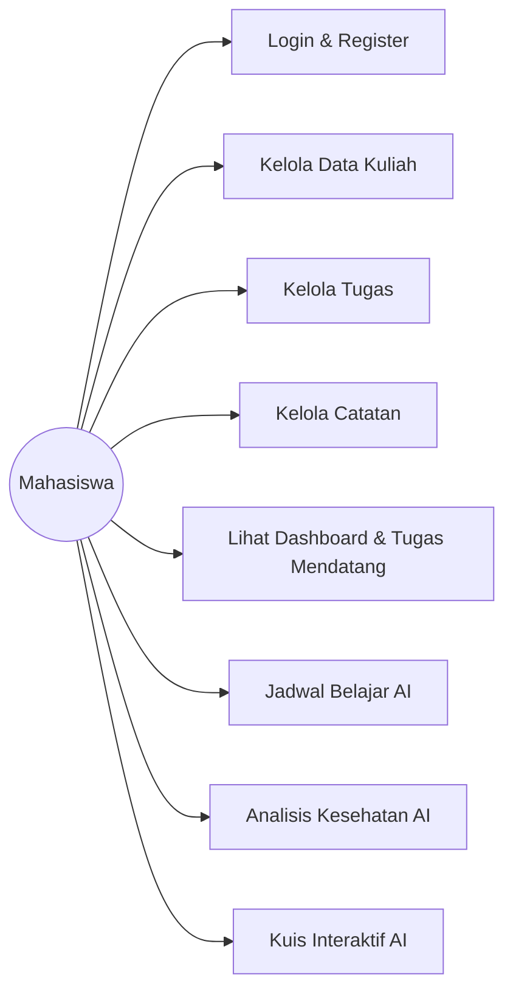
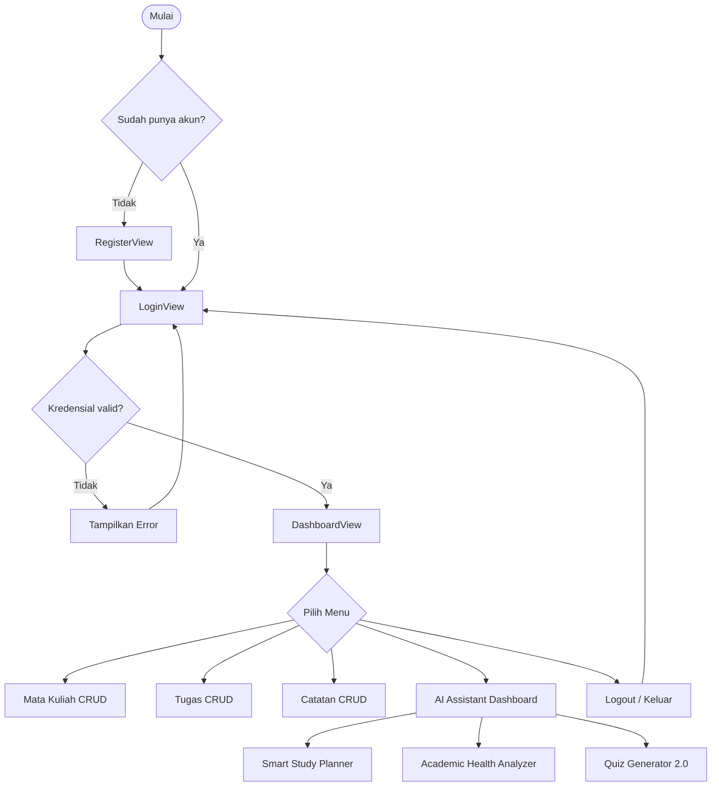

# SOFTWARE REQUIREMENTS SPECIFICATION (SRS)

# UMT Academic Assistant

### AI-Powered Academic Productivity Platform

Version: 1.0 (Final Release)

Status: Approved / Final

---

# 1. Introduction

## 1.1 Purpose
Dokumen ini menjelaskan spesifikasi kebutuhan perangkat lunak (Software Requirements Specification) untuk aplikasi **UMT Academic Assistant**. Dokumen ini menjadi pedoman utama dalam pengembangan, pengujian, dan evaluasi kualitas sistem untuk pengumpulan UAS Pemrograman Berorientasi Objek.

## 1.2 Scope
UMT Academic Assistant adalah aplikasi desktop berbasis Java Swing dengan look-and-feel FlatLaf yang membantu mahasiswa mengelola aktivitas akademik mereka secara privat (multi-user terisolasi) serta memanfaatkan kecerdasan buatan (AI) berbasis Google Gemini 2.5 Flash melalui Replicate API.

Fitur utama meliputi:
* Otentikasi Pengguna (Login, Register, Logout, Session)
* Manajemen Mata Kuliah (CRUD terfilter user)
* Manajemen Tugas (CRUD terfilter user dengan Calendar datepicker)
* Manajemen Catatan (CRUD terfilter user)
* Dashboard Akademik (Dynamic Greeting, Statistik, Tugas Mendatang)
* Smart Study Planner (Plan card generator dengan timestamp)
* Academic Health Analyzer (Produktivitas score badge warna)
* Quiz Generator (Kuis interaktif, scoring, & review jawaban)

---

# 2. Overall Description

## 2.1 Product Perspective
Aplikasi berjalan di lingkungan desktop client-side menggunakan JDK 17, Swing GUI, FlatLaf Theme Manager, dan berkomunikasi dengan database relasional MySQL lokal menggunakan JDBC Driver. Integrasi AI dilakukan secara asynchronous memanfaatkan Java HttpClient untuk mengirim HTTP POST ke REST API endpoint Replicate.

## 2.2 Product Functions
Sistem memfasilitasi mahasiswa dalam:
* Membuat akun baru dan masuk secara aman.
* Mengelola data perkuliahan, tugas, dan ringkasan catatan kuliah.
* Membaca ringkasan statistik dan melacak tugas darurat di dashboard.
* Mendapatkan asisten AI untuk merumuskan jadwal prioritas mingguan.
* Mengevaluasi kebugaran akademik secara berkala.
* Mengikuti kuis evaluasi 5 soal pilihan ganda secara interaktif.

---

# 3. Functional Requirements

### FR-01: User Login
* **Deskripsi**: Pengguna dapat masuk ke aplikasi dengan memasukkan username dan password.
* **Input**: Username (`JTextField`), Password (`JPasswordField`).
* **Proses**: Sistem mencocokkan input dengan record di tabel `users`.
* **Output**: Membuka halaman dashboard jika cocok, atau menampilkan pesan kesalahan:
  * Kosong: *"Mohon lengkapi username dan password"*
  * Salah: *"Username atau password salah"*

### FR-02: User Register
* **Deskripsi**: Pengguna dapat membuat akun baru jika belum terdaftar.
* **Input**: Nama Lengkap, Username, Password, Konfirmasi Password.
* **Proses**: Sistem memvalidasi keunikan username di database dan kecocokan password dengan konfirmasinya.
* **Output**: Menyimpan user baru ke database dan mengarahkan kembali ke halaman login dengan pesan sukses.

### FR-03: User Logout
* **Deskripsi**: Pengguna dapat mengakhiri sesi aktif mereka kapan saja.
* **Proses**: Pengguna menekan tombol "Keluar / Logout" di sidebar. Setelah konfirmasi, sistem memanggil `SessionManager.clearSession()`, menutup jendela dashboard utama, dan memunculkan kembali jendela login.

### FR-04: Manage Courses
* **Deskripsi**: Pengguna dapat melakukan operasi CRUD untuk mata kuliah.
* **Aturan Kepemilikan**: Hanya menampilkan mata kuliah yang memiliki `user_id` yang cocok dengan pengguna yang sedang login.
* **Validasi**: Kode matakuliah dan nama matakuliah wajib diisi dan tidak boleh kosong.

### FR-05: Manage Tasks
* **Deskripsi**: Pengguna dapat melakukan operasi CRUD untuk tugas perkuliahan.
* **Aturan Kepemilikan**: Hanya menampilkan dan mengaitkan tugas dengan mata kuliah milik pengguna yang bersangkutan.
* **Tenggat Waktu**: Pemilihan tanggal wajib menggunakan widget dynamic calendar datepicker.
* **Status**: Terdiri atas `Belum Dikerjakan`, `Sedang Dikerjakan`, atau `Selesai`.

### FR-06: Manage Notes
* **Deskripsi**: Pengguna dapat mengelola catatan pembelajaran.
* **Aturan Kepemilikan**: Hanya menampilkan catatan milik pengguna yang aktif. Catatan dapat dihubungkan ke mata kuliah milik pengguna.

### FR-07: Dashboard Statistics & Greeting
* **Deskripsi**: Menampilkan ringkasan data akademik dan sambutan personal.
* **Sambutan**: Menampilkan nama lengkap user secara dinamis ("Selamat Datang, [Nama User]").
* **Statistik**: Menghitung jumlah mata kuliah, total tugas, tugas selesai, tugas tertunda, dan total catatan milik pengguna saat ini.
* **Tugas Mendatang**: Menampilkan daftar hingga 4 tugas tertunda yang memiliki tenggat terdekat dengan aksen warna (Merah untuk tenggat < 2 hari, Oranye < 5 hari, Biru lainnya).

### FR-08: Smart Study Planner
* **Deskripsi**: Menghasilkan rencana belajar mingguan otomatis menggunakan AI.
* **Proses**: Mengambil data seluruh tugas perkuliahan aktif pengguna, mengirimkannya sebagai prompt terstruktur ke AI, dan menampilkan rencana mingguan.
* **Output**: Ditampilkan pada kartu hasil rencana dengan cap tanggal-waktu (timestamp) pembuatan serta tombol "Salin Hasil" ke clipboard.

### FR-09: Academic Health Analyzer
* **Deskripsi**: Mendiagnosis kesehatan produktivitas akademik pengguna lewat AI.
* **Proses**: Mengirimkan statistik angka mata kuliah, tugas tertunda, dan tugas selesai ke AI.
* **Output**: Menampilkan hasil evaluasi dan menempatkan badge skor produktivitas dengan warna khusus (Merah < 50, Oranye/Kuning 50-75, Hijau > 75).

### FR-10: Quiz Generator
* **Deskripsi**: Menguji pemahaman catatan kuliah pengguna secara interaktif.
* **Proses**: AI memproses konten catatan perkuliahan yang dipilih dan merumuskannya ke dalam kuis 5 soal pilihan ganda.
* **Interaktivitas**: Pengguna dapat memilih jawaban A/B/C/D melalui radio button, bernavigasi maju/mundur, menyelesaikan kuis, mendapatkan nilai akhir (0-100), dan meninjau kembali kecocokan jawaban benar/salah.

---

# 4. Non-Functional Requirements

## 4.1 Security
* **Isolasi Data**: Setiap query database SQL CRUD mata kuliah, tugas, dan catatan wajib menyertakan filter `WHERE user_id = ?`.
* **Kredensial Sesi**: Penggunaan `SessionManager` untuk menyimpan user aktif selama masa runtime aplikasi.

## 4.2 Performance
* **Asynchronous Threads**: Seluruh pemanggilan Replicate API untuk modul AI wajib dijalankan di dalam thread latar belakang (`SwingWorker`) agar tidak membekukan (freeze) GUI Event Dispatch Thread (EDT).
* **Connection Pooling**: Re-use koneksi database via database singleton `DBConnection`.

## 4.3 Usability
* **Consistent UI**: Penggunaan framework FlatLaf (FlatLightLaf) untuk memastikan tampilan yang seragam dan modern.
* **Responsiveness**: Transisi tampilan menggunakan `CardLayout` untuk menyembunyikan kontainer kosong sebelum data AI selesai digenerate.

## 4.4 Reliability
* **Integrity Constraints**: Penggunaan foreign key dengan opsi `ON DELETE CASCADE` di database MySQL untuk menjamin bahwa jika user atau matakuliah dihapus, seluruh tugas dan catatan yang terelasi akan terhapus otomatis secara konsisten.

---

# 5. Use Case Diagram

---

# 6. User Flow

