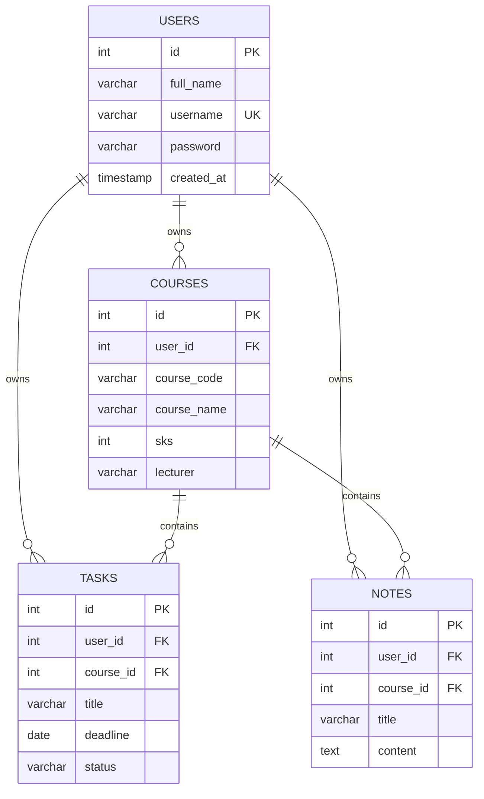
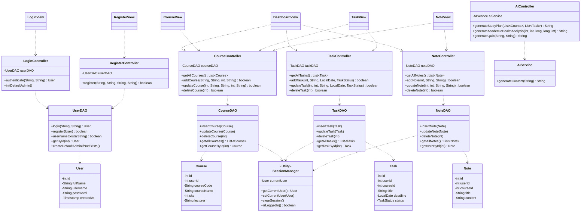
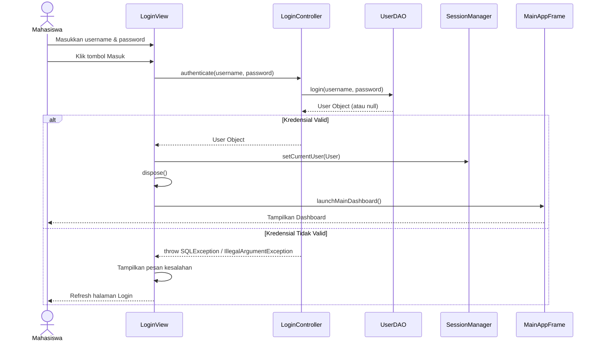
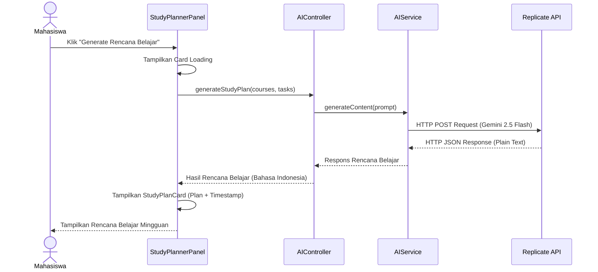
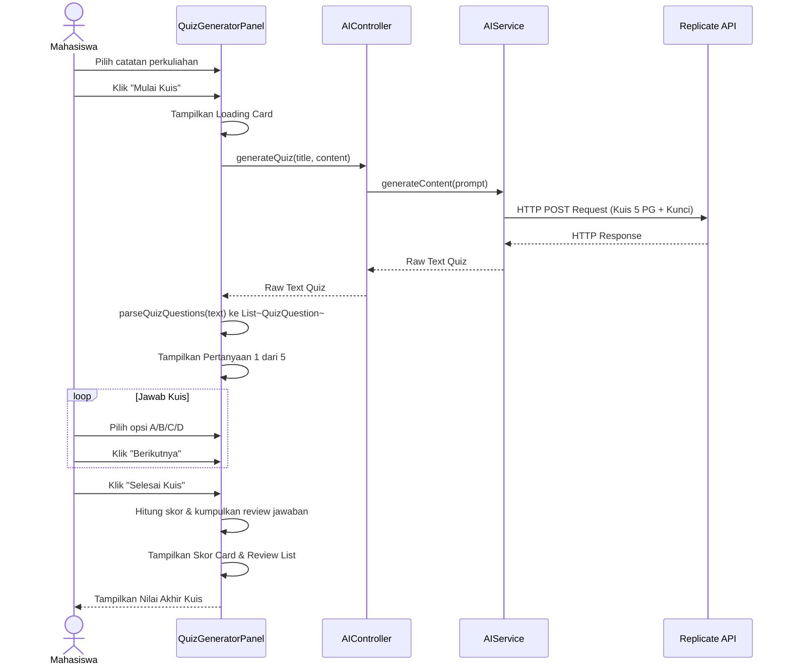
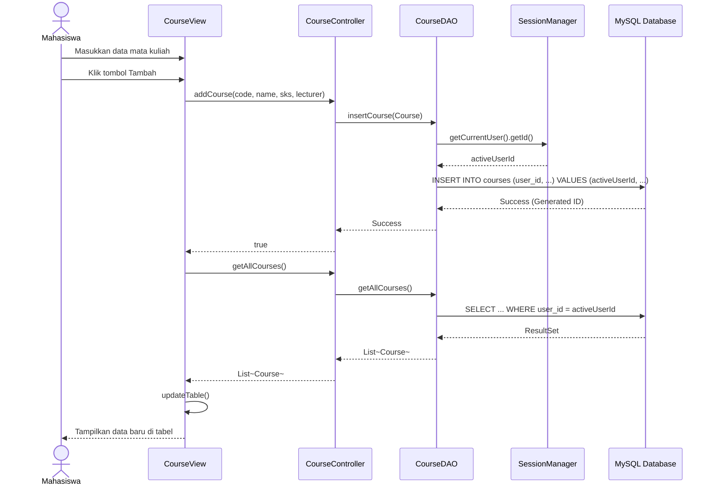
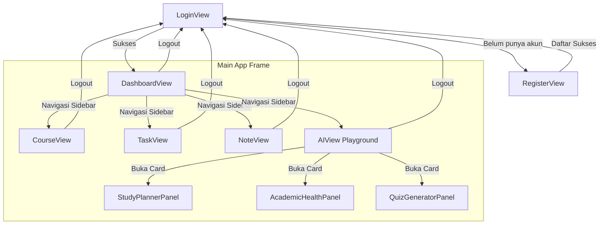

# SYSTEM DESIGN DOCUMENT (SSD)

# UMT Academic Assistant

### AI-Powered Academic Productivity Platform

Version: 1.0 (Final Release)

Status: Approved / Final

---

# 1. System Architecture

## Architecture Style
Model View Controller (MVC) pattern.

Tujuan:
* Memisahkan antarmuka (Swing GUI), logika kendali (Controller), dan data (Model + DAO).
* Mengamankan data dengan membatasi akses database berdasarkan context session pengguna aktif (`SessionManager`).
* Menjaga responsivitas UI dengan thread latar belakang (`SwingWorker`) untuk pengolahan data AI eksternal.

## High Level Architecture

```mermaid
flowchart TD
    User([Mahasiswa])
    
    subgraph View Layer (Swing & FlatLaf)
        LoginView
        RegisterView
        DashboardView
        CourseView
        TaskView
        NoteView
        AIView
    end
    
    subgraph Session Management
        SessionManager
    end
    
    subgraph Controller Layer
        LoginController
        RegisterController
        CourseController
        TaskController
        NoteController
        AIController
    end
    
    subgraph Service Layer
        AIService
    end
    
    subgraph Model & DAO Layer
        Model[User / Course / Task / Note]
        DAO[UserDAO / CourseDAO / TaskDAO / NoteDAO]
    end
    
    subgraph External Systems
        MySQL[(MySQL Local DB)]
        Replicate[Replicate API]
    end
    
    User --> View Layer
    View Layer --> Controller Layer
    Controller Layer --> SessionManager
    Controller Layer --> ServiceLayer
    Controller Layer --> DAO
    ServiceLayer --> Replicate
    DAO --> MySQL
    DAO -.-> Model
```

---

# 2. Package Structure

```text
src/
├── model/
│   ├── User.java
│   ├── Course.java
│   ├── Task.java
│   ├── Note.java
│   └── TaskStatus.java
├── view/
│   ├── LoginView.java
│   ├── RegisterView.java
│   ├── DashboardView.java
│   ├── CourseView.java
│   ├── TaskView.java
│   ├── NoteView.java
│   ├── AIView.java
│   ├── StudyPlannerPanel.java
│   ├── AcademicHealthPanel.java
│   └── QuizGeneratorPanel.java
├── controller/
│   ├── LoginController.java
│   ├── RegisterController.java
│   ├── CourseController.java
│   ├── TaskController.java
│   ├── NoteController.java
│   └── AIController.java
├── dao/
│   ├── UserDAO.java
│   ├── CourseDAO.java
│   ├── TaskDAO.java
│   └── NoteDAO.java
├── database/
│   └── DBConnection.java
├── service/
│   └── AIService.java
├── utils/
│   ├── ConfigReader.java
│   ├── ThemeManager.java
│   └── SessionManager.java
└── main/
    └── Main.java
```

---

# 3. Database Design

## Entity Relationship Diagram



---

# 4. Class Diagram



---

# 5. Sequence Diagrams

## 5.1 Login Flow



## 5.2 Generate Study Plan (AI)



## 5.3 Generate & Mainkan Kuis (Interactive Mode)



## 5.4 CRUD Course (Mata Kuliah)



---

# 6. Navigation Flow


