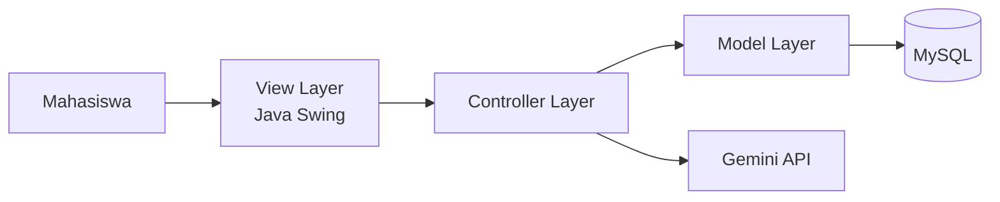
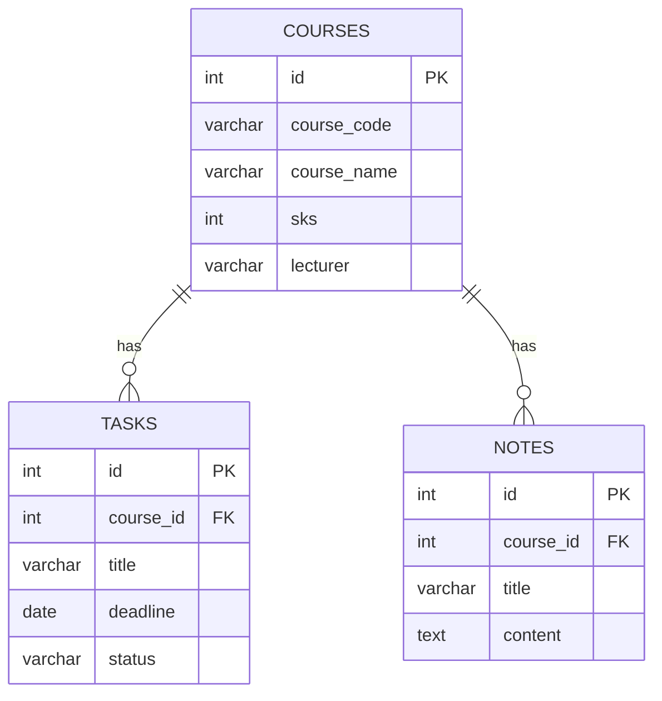
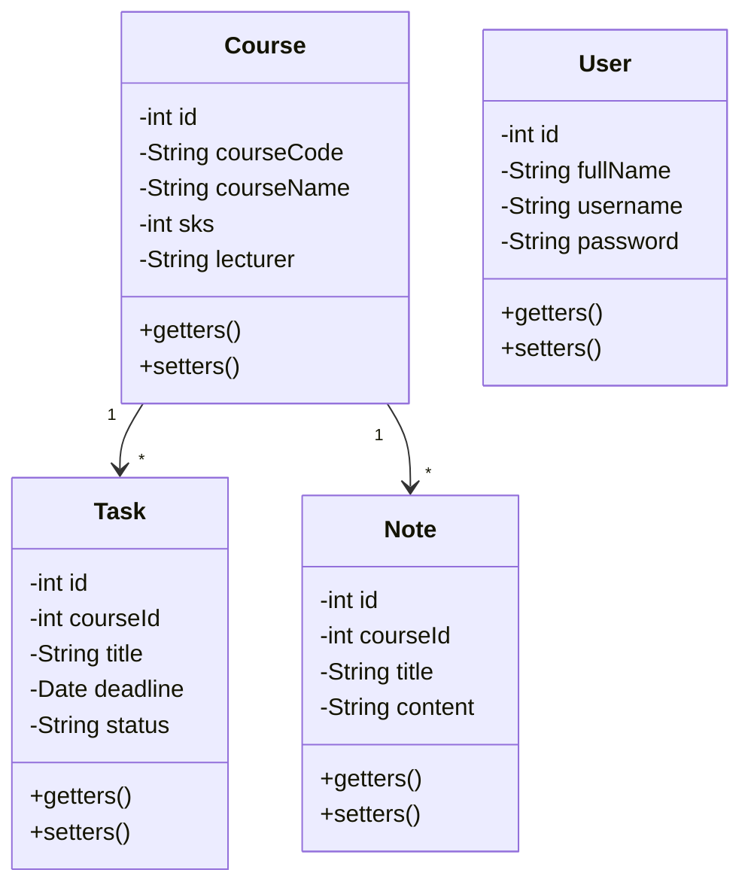
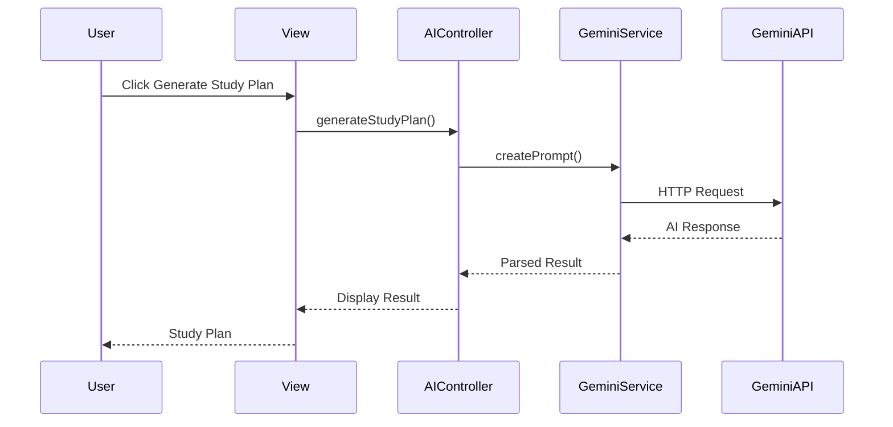
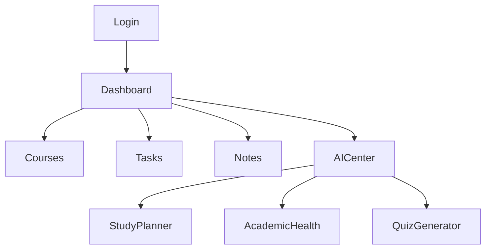
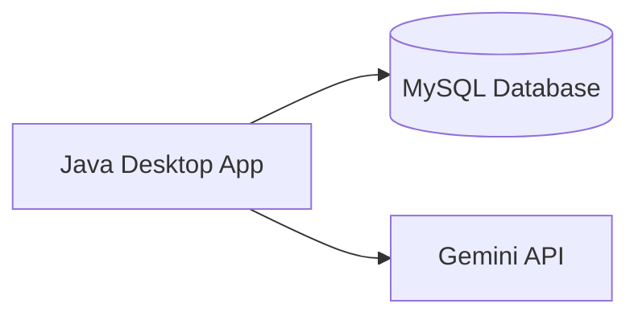

# SYSTEM DESIGN DOCUMENT (SSD)

# UMT Academic Assistant

### AI-Powered Academic Productivity Platform

Version: 1.0

Status: Approved

---

# 1. System Architecture

## Architecture Style

Model View Controller (MVC)

Tujuan:

* Memisahkan tampilan dan logika bisnis
* Mempermudah maintenance
* Memenuhi konsep OOP

---

## High Level Architecture



---

# 2. Package Structure

```text
src/

model/
├── Course.java
├── Task.java
├── Note.java
├── TaskStatus.java
├── User.java

view/
├── DashboardView.java
├── CourseView.java
├── TaskView.java
├── NoteView.java
├── AIView.java
├── LoginView.java

controller/
├── CourseController.java
├── TaskController.java
├── NoteController.java
├── AIController.java
├── LoginController.java

dao/
├── CourseDAO.java
├── TaskDAO.java
├── NoteDAO.java
├── UserDAO.java


database/
├── DBConnection.java

service/
├── GeminiService.java

utils/
├── ConfigReader.java
├── ThemeManager.java

main/
├── Main.java
```

---

# 3. Database Design

## Entity Relationship Diagram



---

# 4. Database Schema

## Table Courses

```sql
CREATE TABLE courses (
    id INT AUTO_INCREMENT PRIMARY KEY,
    course_code VARCHAR(20),
    course_name VARCHAR(100),
    sks INT,
    lecturer VARCHAR(100)
);
```

---

## Table Tasks

```sql
CREATE TABLE tasks (
    id INT AUTO_INCREMENT PRIMARY KEY,
    course_id INT,
    title VARCHAR(150),
    deadline DATE,
    status VARCHAR(50),

    FOREIGN KEY(course_id)
    REFERENCES courses(id)
);
```

---

## Table Notes

```sql
CREATE TABLE notes (
    id INT AUTO_INCREMENT PRIMARY KEY,
    course_id INT,
    title VARCHAR(150),
    content TEXT,

    FOREIGN KEY(course_id)
    REFERENCES courses(id)
);
```

---

# 5. Class Diagram




---

# 6. DAO Design

## CourseDAO

Responsibilities:

* insertCourse()
* updateCourse()
* deleteCourse()
* getAllCourses()

---

## TaskDAO

Responsibilities:

* insertTask()
* updateTask()
* deleteTask()
* getAllTasks()

---

## NoteDAO

Responsibilities:

* insertNote()
* updateNote()
* deleteNote()
* getAllNotes()

---

## UserDAO

Responsibilities:

* login(username, password)
* createDefaultAdminIfNotExists()

---


---

# 7. Controller Design

## CourseController

Responsibilities:

* Handle Course CRUD
* Validate input

---

## TaskController

Responsibilities:

* Handle Task CRUD
* Validate input

---

## NoteController

Responsibilities:

* Handle Note CRUD

---

## AIController

Responsibilities:

* Generate Study Plan
* Analyze Academic Health
* Generate Quiz

---

## LoginController

Responsibilities:

* Authenticate user credentials
* Validate login form inputs
* Launch main application dashboard upon success


---

# 8. AI Architecture

## AI Workflow



---

# 9. Prompt Engineering Design

## Smart Study Planner

Prompt Template

```text
Anda adalah Academic Planner.

Berikut daftar tugas mahasiswa:

{TASK_LIST}

Buat:

1. Prioritas tugas
2. Jadwal belajar
3. Rekomendasi belajar
```

---

## Academic Health Analyzer

Prompt Template

```text
Anda adalah Academic Advisor.

Data akademik:

{COURSES}
{TASKS}

Berikan:

1. Academic Health Score (0-100)
2. Analisis
3. Risiko
4. Saran
```

---

## Quiz Generator

Prompt Template

```text
Anda adalah Dosen Universitas.

Berdasarkan materi berikut:

{NOTE_CONTENT}

Buat:

5 soal pilihan ganda
3 soal essay

Sertakan jawaban.
```

---

# 10. Navigation Structure




---

# 11. Screen Design

## Dashboard

Components:

* Total Courses Card
* Total Tasks Card
* Completed Tasks Card
* Pending Tasks Card

---

## Course Page

Components:

* JTable Course
* Add Button
* Edit Button
* Delete Button

---

## Task Page

Components:

* JTable Task
* Add Button
* Edit Button
* Delete Button

---

## Note Page

Components:

* JTable Notes
* Add Button
* Edit Button
* Delete Button

---

## AI Center

Tab 1

Study Planner

Button:

Generate Study Plan

---

Tab 2

Academic Health

Button:

Analyze Academic Health

---

Tab 3

Quiz Generator

Button:

Generate Quiz

---

# 12. Error Handling

## Database Error

Message:

"Database connection failed."

---

## API Error

Message:

"Failed to connect to Gemini API."

---

## Validation Error

Message:

"Please complete all required fields."

---

# 13. Deployment Architecture



---

# 14. Development Priority

Priority 1

* Database
* Model
* DAO

---

Priority 2

* CRUD Course
* CRUD Task
* CRUD Note

---

Priority 3

* Dashboard

---

Priority 4

* Gemini Integration

---

Priority 5

* Study Planner
* Academic Health
* Quiz Generator

---

# 15. Definition of Done

Project dianggap selesai apabila:

* Semua CRUD berjalan.
* Database tersambung.
* Dashboard berjalan.
* Gemini API berhasil terintegrasi.
* Smart Study Planner berjalan.
* Academic Health Analyzer berjalan.
* Quiz Generator berjalan.
* Tidak terdapat error saat demonstrasi UAS.
